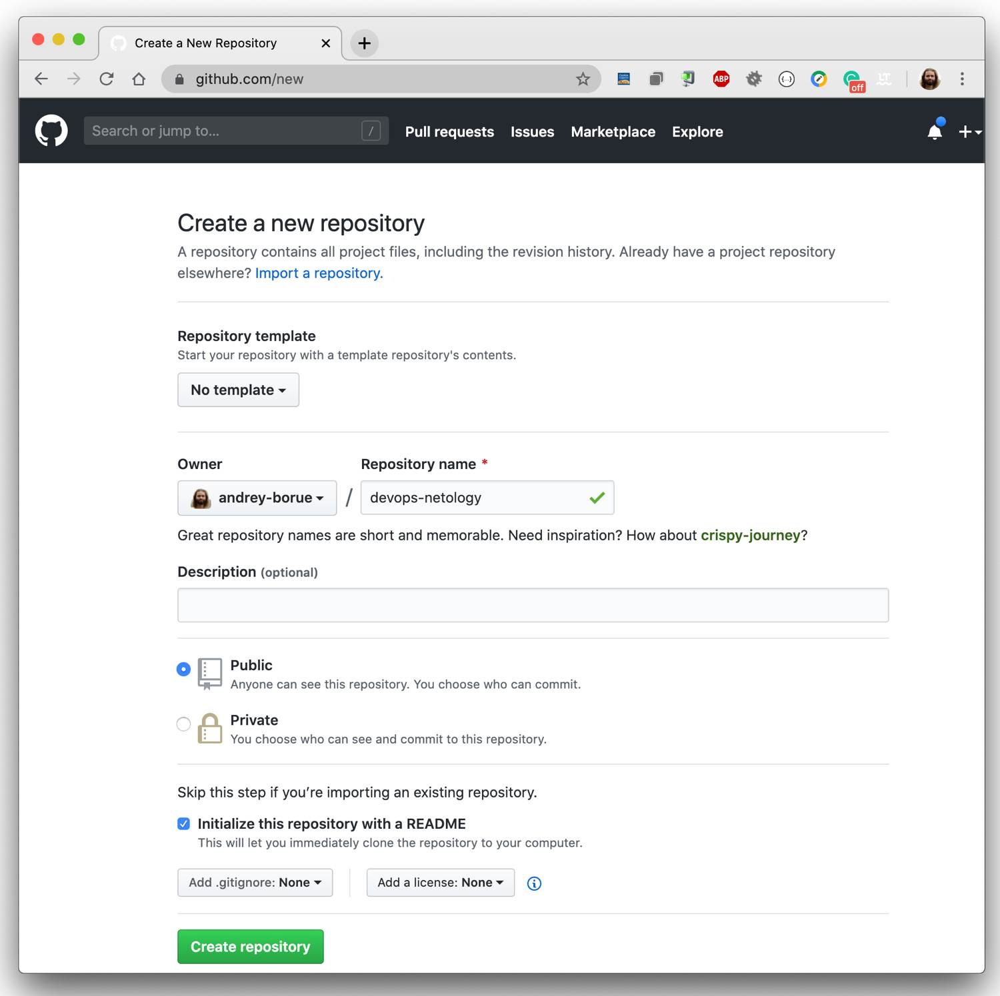
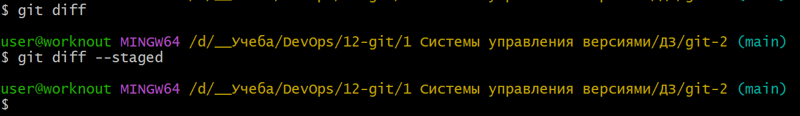

# git-2# Домашнее задание к занятию «Системы контроля версий» - Илларионов Дмитрий

### Цель задания

В результате выполнения задания вы: 

* научитесь подготоваливать новый репозиторий к работе;
* сохранять, перемещать и удалять файлы в системе контроля версий.  


### Чеклист готовности к домашнему заданию

1. Установлена консольная утилита для работы с Git.


### Инструкция к заданию

1. Домашнее задание выполните в GitHub-репозитории. 
2. В личном кабинете отправьте на проверку ссылку на ваш репозиторий с домашним заданием.
3. Любые вопросы по решению задач задавайте в чате учебной группы.


### Дополнительные материалы для выполнения задания

1. [GitHub](https://github.com/).
2. [Инструкция по установке Git](https://git-scm.com/downloads).
3. [Книга про  Git на русском языке](https://git-scm.com/book/ru/v2/) - рекомендуем к обязательному изучению главы 1-7.
   
   
------

## Задание 1. Создать и настроить репозиторий для дальнейшей работы на курсе

В рамках курса вы будете писать скрипты и создавать конфигурации для различных систем, которые необходимо сохранять для будущего использования. 
Сначала надо создать и настроить локальный репозиторий, после чего добавить удалённый репозиторий на GitHub.

### Создание репозитория и первого коммита

1. Зарегистрируйте аккаунт на [https://github.com/](https://github.com/). Если предпочитаете другое хранилище для репозитория, можно использовать его.

#### Решение 

Аккаунт на GitHub уже был давно создан ранее при выполнении старого ДЗ https://github.com/DmitryIll/my_hw_git-gitlab_hs/blob/main/README.md 

2. Создайте публичный репозиторий, который будете использовать дальше на протяжении всего курса, желательное с названием `devops-netology`.
   Обязательно поставьте галочку `Initialize this repository with a README`. 
 
    

#### Решение 

Создал этот репозиторий https://github.com/DmitryIll/git-2 

3. Создайте [авторизационный токен](https://docs.github.com/en/authentication/keeping-your-account-and-data-secure/creating-a-personal-access-token) для клонирования репозитория.

#### Решение 

Ранее уже был создан токен:


Пересоздал - перегенерил для обновления даты окончания.


4. Склонируйте репозиторий, используя протокол HTTPS (`git clone ...`).
 
    

#### Решение

Склонировал

5. Перейдите в каталог с клоном репозитория (`cd devops-netology`).
6. Произведите первоначальную настройку Git, указав своё настоящее имя, чтобы нам было проще общаться, и email (`git config --global user.name` и `git config --global user.email johndoe@example.com`). 

#### Решение 
было сделано еще раньше в прошлых ДЗ.
Выполнил:


Результат:


7. Выполните команду `git status` и запомните результат.

Выполнил (но я уже начал создавать файлы):


8. Отредактируйте файл `README.md` любым удобным способом, тем самым переведя файл в состояние `Modified`.
9. Ещё раз выполните `git status` и продолжайте проверять вывод этой команды после каждого следующего шага. 

Выполнил:


- видно что есть измененные файлы или новые.

10. Теперь посмотрите изменения в файле `README.md`, выполнив команды `git diff` и `git diff --staged`.

```
git diff
```


Показаны изменения в файле.

`git diff --staged`


- в staged пока нет ничего

11. Переведите файл в состояние `staged` (или, как говорят, просто добавьте файл в коммит) командой `git add README.md`.

Выполнил:


12. И ещё раз выполните команды `git diff` и `git diff --staged`. Поиграйте с изменениями и этими командами, чтобы чётко понять, что и когда они отображают. 

Теперь gid diff ничего не показывает, т.к. все изменения ушли в Staged т.е. относительно staged никаких новых изменений нет.


А вот в Staged показаны измененеия:


Если добавить еще изменения в файл - то опять сначала в git diff а потом после Add в git staged .


13. Теперь можно сделать коммит `git commit -m 'First commit'`.


14. И ещё раз посмотреть выводы команд `git status`, `git diff` и `git diff --staged`.





### Создание файлов `.gitignore` и второго коммита

1. Создайте файл `.gitignore` (обратите внимание на точку в начале файла), проверьте его статус сразу после создания. 


1. Добавьте файл `.gitignore` в следующий коммит (`git add...`).

и остальные файлы добавил в индекс.


1. На одном из следующих блоков вы будете изучать `Terraform`, давайте сразу создадим соотвествующий каталог `terraform` и внутри этого каталога — файл `.gitignore` по примеру: https://github.com/github/gitignore/blob/master/Terraform.gitignore.  

Создал и добавил код в gitignore, но, не из примера а из своих наработок, т.к. в моих наработках уже более полный код.

1. В файле `README.md` опишите своими словами, какие файлы будут проигнорированы в будущем благодаря добавленному `.gitignore`.

```
**/.terraform/*
```
Например если в структуре папок в любом месте будет папка.terraform , то, все содержимое не будет попадать в репозиторий.

```
*.tfstate
*.tfstate.*
```

- любые файлы во всех папках похожие на эти по маске - будут игнорироваться.

```
.terraform.lock.hcl
crash.log
override.tf
override.tf.json
```
- эти файлы будут игнорироваться

```
*_override.tf
*_override.tf.json
*.auto.tfvars
```
- эти файлы по маске будут игнорироваться.

1. Закоммитьте все новые и изменённые файлы. Комментарий к коммиту должен быть `Added gitignore`.


### Эксперимент с удалением и перемещением файлов (третий и четвёртый коммит)

1. Создайте файлы `will_be_deleted.txt` (с текстом `will_be_deleted`) и `will_be_moved.txt` (с текстом `will_be_moved`) и закоммите их с комментарием `Prepare to delete and move`.


1. В случае необходимости обратитесь к [официальной документации](https://git-scm.com/book/ru/v2/Основы-Git-Запись-изменений-в-репозиторий) — здесь подробно описано, как выполнить следующие шаги. 
1. Удалите файл `will_be_deleted.txt` с диска и из репозитория. 
1. Переименуйте (переместите) файл `will_be_moved.txt` на диске и в репозитории, чтобы он стал называться `has_been_moved.txt`.
1. Закоммитьте результат работы с комментарием `Moved and deleted`.


### Проверка изменения

1. В результате предыдущих шагов в репозитории должно быть как минимум пять коммитов (если вы сделали ещё промежуточные — нет проблем):
    * `Initial Commit` — созданный GitHub при инициализации репозитория. 
    * `First commit` — созданный после изменения файла `README.md`.
    * `Added gitignore` — после добавления `.gitignore`.
    * `Prepare to delete and move` — после добавления двух временных файлов.
    * `Moved and deleted` — после удаления и перемещения временных файлов. 
2. Проверьте это, используя комманду `git log`. Подробно о формате вывода этой команды мы поговорим на следующем занятии, но посмотреть, что она отображает, можно уже сейчас.


### Отправка изменений в репозиторий

Выполните команду `git push`, если Git запросит логин и пароль — введите ваши логин и пароль от GitHub. 


В качестве результата отправьте ссылку на репозиторий. 

----

### Правила приёма домашнего задания

В личном кабинете отправлена ссылка на ваш репозиторий.


### Критерии оценки

Зачёт:

* выполнены все задания;
* ответы даны в развёрнутой форме;
* приложены соответствующие скриншоты и файлы проекта;
* в выполненных заданиях нет противоречий и нарушения логики.

На доработку:

* задание выполнено частично или не выполнено вообще;
* в логике выполнения заданий есть противоречия и существенные недостатки. 
